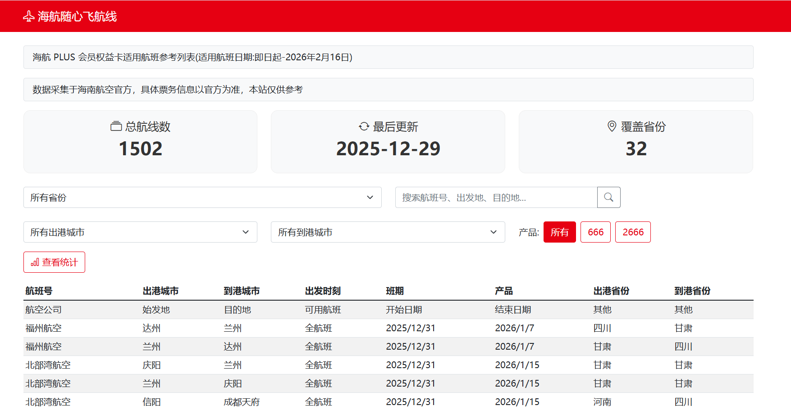

# 海航随心飞航线展示系统

本项目用于抓取并展示「海航 PLUS 会员权益卡」适用航线列表，提供筛选、搜索和统计等功能，可通过浏览器查看最新航线信息。

后端基于 Flask，前端使用 Bootstrap，支持自动定时抓取与多数据源合并，并提供打包后的独立可执行程序（无需安装 Python 环境）。

## 页面预览



## 功能概览

- 自动从海南航空官方页面抓取「PLUS 会员专享产品适用航线表（参考）」数据
- 支持多来源页面合并，按“航班号 + 始发地 + 目的地”去重，后来的数据覆盖旧数据
- 航线列表展示，支持：
  - 按省份筛选
  - 按出港城市、到港城市筛选
  - 产品筛选（666 / 2666 等）
  - 关键字搜索（航班号、出发地、目的地）
- 统计信息：
  - 总航线数
  - 覆盖省份数
  - 各省份航线数量统计
- 数据维护与诊断：
  - 定时任务每日自动抓取
  - 诊断接口查看省份为“其他”的城市列表
- 一键启动：
  - 源码版本一键启动脚本
  - 打包后可执行程序，双击即可启动服务并自动打开浏览器

## 目录结构简要说明

- `app.py`：Flask Web 应用入口、API 路由与定时任务调度
- `crawler.py`：航线抓取与解析逻辑、多数据源合并、数据缓存
- `templates/index.html`：前端页面与筛选、分页、统计展示逻辑
- `hainan_airlines_data.json`：抓取后的本地航线数据缓存
- `一键启动.bat`：基于本机 Python 环境的一键启动脚本
- `dist/HNA_Lines/HNA_Lines.exe`：打包后的独立可执行程序（PyInstaller 生成）

## 数据来源与更新时间

- 数据来源：海南航空官方「海航 PLUS 会员专享产品适用航线表（参考）」页面
- 当前已使用的来源链接示例：
  - `https://m.hnair.com/cms/me/plus/info/202508/t20250808_78914.html`
  - `https://m.hnair.com/cms/me/plus/syhx/202512/t20251229_82220.html`
- 来源更新时间显示规则：
  - 从 URL 中解析形如 `tYYYYMMDD_xxxx.html` 的日期字段
  - 例如：`t20251229_82220.html` 显示为 `2025-12-29`

页面顶部的「适用航班日期」可以根据实际官方说明手工更新，当前示例为：

- `即日起-2026年2月16日`

## 一键启动（源码版本）

前提：本机已安装 Python 3 和依赖（Flask、requests、BeautifulSoup 等）。

步骤：

1. 在项目根目录双击 `一键启动.bat`
2. 脚本会自动执行：
   - 运行 `crawler.py` 抓取并合并最新航线数据
   - 启动 Flask 服务 `python app.py`
   - 等待短暂时间后自动打开浏览器访问 `http://127.0.0.1:5000/`

适合在开发环境或已经装好 Python 的机器上使用。

## 打包后的独立运行方式（无需环境）

项目已经配置 PyInstaller 打包，可在 Windows 上生成独立可执行程序。

### 已生成的可执行程序

- 路径：`dist/HNA_Lines/HNA_Lines.exe`
- 特点：
  - 已内置 Python 解释器和所有依赖
  - 可直接拷贝到其他 Windows 机器运行，无需安装任何环境

### 双击自动打开浏览器

已在 `app.py` 中集成自动打开浏览器逻辑：

- 当程序启动并监听指定端口时，会自动尝试打开：
  - `http://127.0.0.1:5000/`
- 在打包后的 `HNA_Lines.exe` 上双击：
  - 会启动内置 Flask 服务
  - 同时打开默认浏览器访问首页

如需修改端口，可通过环境变量控制，例如：

```powershell
set PORT=8000
HNA_Lines.exe
```

此时程序会监听 `0.0.0.0:8000`，并尝试打开 `http://127.0.0.1:8000/`。

### 在其他机器上运行

1. 从开发环境拷贝整个目录：`dist/HNA_Lines`
2. 在目标机器上进入该目录
3. 双击 `HNA_Lines.exe`
4. 稍等片刻，浏览器会自动打开航线展示页面

如果自动打开浏览器失败，也可以手工在浏览器输入：

- `http://127.0.0.1:5000/`

## 本地开发与调试

### 安装依赖

在项目根目录执行：

```bash
python -m pip install -r requirements.txt
```

如果没有 `requirements.txt`，可以根据当前项目安装（示例）：

```bash
python -m pip install flask requests beautifulsoup4 lxml apscheduler pypinyin
```

### 直接运行开发服务

```bash
python app.py
```

启动后访问：

- `http://127.0.0.1:5000/`

此模式下：

- 会在首次启动时根据本地 JSON 是否存在决定是否抓取
- 使用调试模式 `debug=True`，方便开发
- 已处理定时任务和浏览器自动打开的重复执行问题

## 数据抓取与合并策略

- 多数据源抓取：
  - `crawler.py` 中维护一个 URL 列表 `self.urls`
  - 依次请求每个官方页面，解析表格行生成航线数据
- 合并与去重：
  - 以「航班号 + 出发城市 + 到达城市」作为唯一键
  - 若新数据中存在相同键，则覆盖旧记录
  - 最终合并为一份完整航线列表写入 `hainan_airlines_data.json`
- 本地缓存：
  - 对 JSON 数据和来源更新时间做内存缓存，减少频繁读盘和网络请求

## 定时任务与诊断

- 定时任务：
  - 使用 APScheduler 配置每日凌晨定时抓取，更新本地数据
  - 在调试模式下避免重复调度
- 诊断接口：
  - `/api/missing_cities`：返回省份为“其他”的城市与计数，用于完善省份映射表

## 打包命令说明（开发者）

如需在其他环境重新打包，可在项目根目录执行：

```bash
python -m PyInstaller --noconfirm --clean --name HNA_Lines --add-data "templates;templates" app.py
```

说明：

- `--name HNA_Lines`：生成的程序名为 `HNA_Lines.exe`
- `--add-data "templates;templates"`：将 `templates` 目录打包到可执行文件所在目录的 `templates` 中，保证 Flask 模板可以被正确加载
- 打包完成后，可执行文件位于：
  - `dist/HNA_Lines/HNA_Lines.exe`

## 注意事项

- 本项目仅用于航线信息参考，具体票务与适用规则以海南航空官方为准
- 抓取频率不宜过高，避免对官方服务造成压力
- 如官方页面结构有变动，可能需要调整 `crawler.py` 中的解析逻辑

