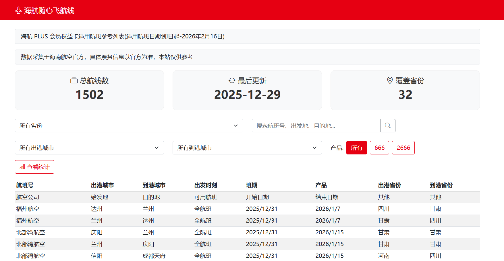

# 海航随心飞航线展示系统

本项目用于抓取并展示「海航 PLUS 会员权益卡」适用航线列表，提供筛选、搜索和统计等功能。

**部署方式：静态站点 + GitHub Actions 定时更新 + Vercel 托管**

## 页面预览



## 功能概览

- 自动从海南航空官方页面抓取「PLUS 会员专享产品适用航线表（参考）」数据
- 支持多来源页面合并，按"航班号 + 始发地 + 目的地"去重
- 航线列表展示，支持：
  - 按省份筛选
  - 按出港城市、到港城市筛选
  - 产品筛选（666 / 2666 等）
  - 关键字搜索（航班号、出发地、目的地）
- 统计信息：
  - 总航线数
  - 覆盖省份数
  - 各省份航线数量统计

## 快速部署到 Vercel

### 步骤 1：准备 GitHub 仓库

1. 将本项目推送到你的 GitHub 仓库

### 步骤 2：配置 GitHub Actions（可选）

项目已包含 `.github/workflows/crawl.yml`，会自动：
- 每天北京时间凌晨 2:00 抓取最新数据
- 如有数据变化，自动提交到仓库

你也可以在 GitHub Actions 页面手动触发工作流。

### 步骤 3：部署到 Vercel

1. 访问 [vercel.com](https://vercel.com) 并登录（可用 GitHub 账号）
2. 点击 **Add New Project**
3. 选择你的 GitHub 仓库
4. 保持默认配置，点击 **Deploy**
5. 部署完成后，Vercel 会给你一个域名（如 `your-project.vercel.app`）

### 步骤 4：后续更新

- **自动更新**：GitHub Actions 每天自动抓取并提交，Vercel 会自动重新部署
- **手动更新**：在 GitHub Actions 中手动运行 "定时抓取海航航线数据" 工作流

## 本地开发

### 安装依赖

```bash
pip install -r requirements.txt
```

### 抓取数据

```bash
python crawler.py
```

### 预览页面

直接用浏览器打开 `index.html`，或使用本地服务器：

```bash
python -m http.server 8000
```

然后访问 `http://localhost:8000`

## 目录结构

- `index.html` - 静态页面
- `app.js` - 前端逻辑（筛选、搜索、分页等）
- `crawler.py` - 数据抓取脚本
- `hainan_airlines_data.json` - 抓取后的航线数据
- `.github/workflows/crawl.yml` - GitHub Actions 定时任务配置
- `vercel.json` - Vercel 部署配置
- `requirements.txt` - Python 依赖（仅抓取脚本需要）

## 数据来源与更新时间

- 数据来源：海南航空官方「海航 PLUS 会员专享产品适用航线表（参考）」页面
- 当前已使用的来源链接：
  - `https://m.hnair.com/cms/me/plus/info/202508/t20250808_78914.html`
  - `https://m.hnair.com/cms/me/plus/syhx/202512/t20251229_82220.html`
- 来源更新时间：从 URL 中解析形如 `tYYYYMMDD_xxxx.html` 的日期字段

页面顶部的「适用航班日期」可根据实际官方说明在 `index.html` 中手动更新。

## 自定义配置

### 修改抓取频率

编辑 `.github/workflows/crawl.yml`，调整 `cron` 表达式：

```yaml
on:
  schedule:
    - cron: '0 18 * * *'  # 每天 UTC 18:00（北京时间凌晨 2:00）
```

### 修改端口号（本地开发）

```bash
python -m http.server 8080
```

## 注意事项

- 本项目仅用于航线信息参考，具体票务与适用规则以海南航空官方为准
- 抓取频率不宜过高，避免对官方服务造成压力
- 如官方页面结构有变动，可能需要调整 `crawler.py` 中的解析逻辑

## 技术栈

- **前端**：原生 HTML + JavaScript + Bootstrap 5
- **数据抓取**：Python (requests + BeautifulSoup4)
- **自动化**：GitHub Actions
- **部署**：Vercel（静态站点托管）
